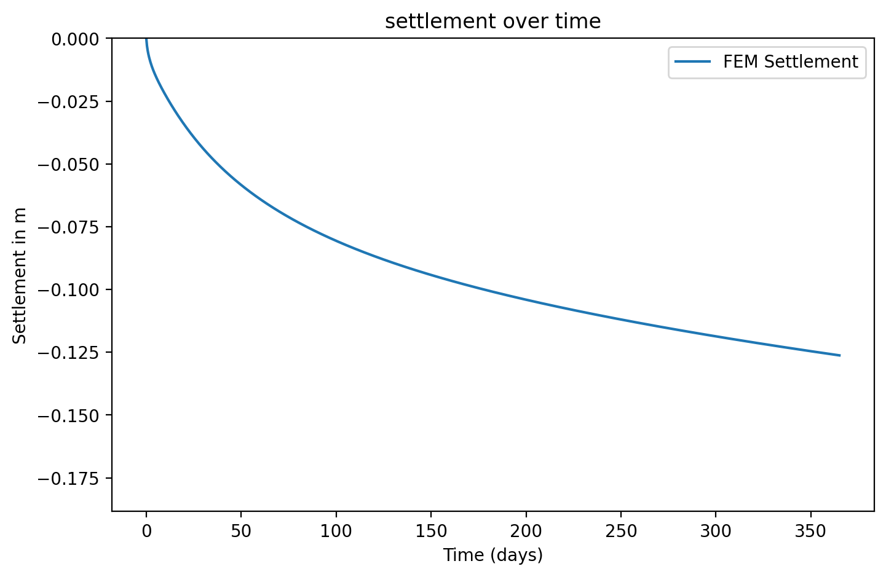
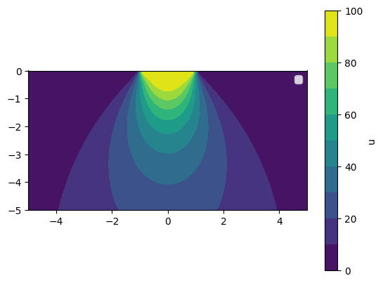
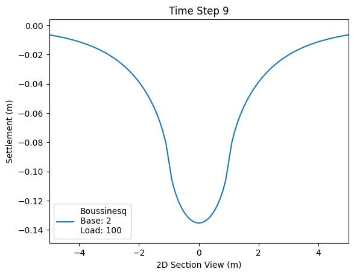

# Finite Element Methods for Geotechnical Consolidation

This repository explores 1D and 2D consolidation modelling for saturated soils using FEniCSx and Streamlit. The current focus is Terzaghi-style consolidation, comparing analytical and FEM based pore pressure dissipation and settlement predictions.

The project is still in active development. At the moment, the codebase is strongest in:

- `terzaghi_1d`: single-layer 1D consolidation with analytical and FEM solvers
- `terzaghi_1d_multi`: multilayer 1D FEM consolidation with listed layer dependent `Cv` and `Mv` arrays inputs
- Streamlit pages for interactive exploration of the single layer and multilayer 1D models
- notebooks for verification, comparison, and model-development work

## Current Status

- Single layer 1D verification is the most mature part of the repository.
- Multilayer 1D solving is implemented, but the verification campaign is still the main next task.
- 2D work is present only as early stage draft material.

## Theory Summary

For 1D Terzaghi consolidation, the governing equation solved here is the diffusion-type excess pore pressure equation

```text
du/dt = Cv d²u/dz²
```

where:

- `u` is excess pore pressure
- `t` is time
- `z` is depth
- `Cv` is the coefficient of consolidation

For the 1D & 2D work, the top boundary is treated as drained, so the pore pressure at the drainage boundary is enforced as zero during the FEM solve.

Settlement is post processed from the pore pressure dissipation history using the compressibility parameter (`Mv`). The settlement is given by, the change in excess pore pressure to estimate strain and then integrates through depth to obtain settlement.

Modelling notes (interpretation and verification):

1. The Boussinesq style initial pore pressure profile is regularised near the drained boundary to avoid singularity behaviour at `z = 0`. This is a deliberately done, so that the initial condition is a approximation the singularity on the surface.
2. Settlement is evaluated using a discrete depth summation over the mesh spacing. This is a numerical quadrature choice. This should be compared against alternatives quadrature choices such as trapezoidal integration so that settlement trends are not confused with post processing error.

## Repository Structure

```text
Geotechnical-Consolidation-FEM/
|-- app.py
|-- pages/
|   |-- 1_1d_terazaghi.py
|   `-- 2_1d_multilayer_terazaghi.py
|-- notebooks/
|   |-- 1_terzaghi_1d_singlelayer.ipynb
|   |-- 2_Analytical_Fourier_Series.ipynb
|   `-- 3_terzaghi_1d_multilayer.ipynb
|-- src/
|   |-- geotech_consolidation/
|   |   `-- models/
|   |       |-- terzaghi_1d/
|   |       |-- terzaghi_1d_multi/
|   |       `-- terzaghi_2d/
|   `-- plotting/
|       |-- terzaghi_1d/
|       `-- terzaghi_2d/
|-- tests/
|   |-- README.md
|   `-- unit/
|-- assets/
|   `-- images/
|-- .devcontainer/
|-- Dockerfile
|-- requirements.txt
`-- LICENSE
```

## Environment Setup

The FEM solvers depend on the DOLFINx / PETSc / MPI stack. It is recommended to run this project inside a docker container. 

### Option 1 - VS Code Dev Container

1. Open the repository in VS Code.
2. Install the Dev Containers extension.
3. Reopen the project in the container.
4. The container uses the `dolfinx/dolfinx:stable` image.
5. After creation, it installs the Python dependencies from [requirements.txt](/Users/uthmanaziz/Desktop/Github/Consolidation-FEM/Geotechnical-Consolidation-FEM-1/requirements.txt).
6. Run the app with:

```bash
streamlit run app.py
```

### Option 2 - Docker

Build the image:

```bash
docker build -t geotech-consolidation .
```

Run the container:

```bash
docker run -it -p 8501:8501 geotech-consolidation
```

Then start Streamlit inside the container:

```bash
streamlit run app.py --server.address 0.0.0.0
```

Open the app at [http://localhost:8501](http://localhost:8501).

## Running Checks

The lightweight automated checks live in [tests/unit](/Users/uthmanaziz/Desktop/Github/Consolidation-FEM/Geotechnical-Consolidation-FEM-1/tests/unit). They are currently still in devolpmement, so only contains smoke level checks (weak checks) and should be run inside the container environment where `dolfinx`, `mpi4py`, and `pytest` are available.

Typical command:

```bash
python -m pytest -q
```

# Notebook Based Verification
Notebook Based Verification are the main place for more rigorous verfication and comparison of FEM Models. It includes, and is not limited to; analytical comparison, convergence studdies, interface comparison and interpretation of consolidation behaviour.

## Demo Figures

### 1D Consolidation

Example 1D excess pore pressure result:


Example 1D settlement result:



### 2D Consolidation

Example 2D excess pore pressure result:



Example 2D settlement result:




## References

- Terzaghi, K. (1943). *Theoretical Soil Mechanics*. Wiley.
- Biot, M. A. (1941). General theory of three-dimensional consolidation. *Journal of Applied Physics*, 12(2), 155-164.
- FEniCSx Project Documentation: [https://docs.fenicsproject.org/](https://docs.fenicsproject.org/)
- Larson, M. G., and Bengzon, F. (2013). *The Finite Element Method: Theory, Implementation, and Applications*. Springer.
