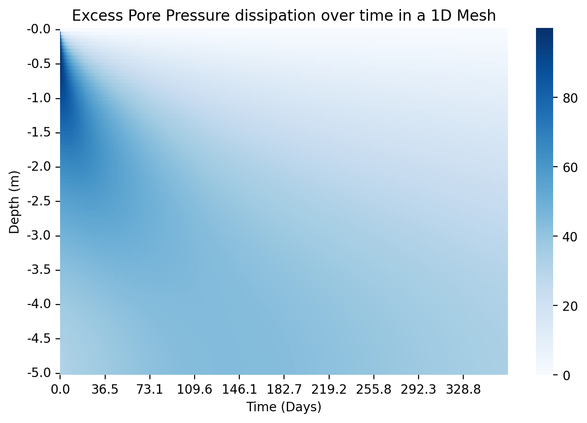

# Finite Element Methods for Geotechnical Consolidation

This repository uses FEniCSx to model excess pore pressure dissipation in soil over time due to consolidation. The project focuses on finite element solvers, verification, and a Streamlit app to show the models.

The repository currently includes:
- **Terzaghi 1D Consolidation (Single Layer)**: Analytical solution + verified FEM model + Streamlit page
- **Terzaghi 1D Consolidation (Multi-Layer)**: FEM model with layered material properties *(working; verification in progress)* + Streamlit page
- **Terzaghi 2D Consolidation (Single or Multi-Layer)**: 2D mesh-based FEM consolidation model *(under active development)*
- **Biot Consolidation (Planned)**: Future fully coupled displacement and pore pressure consolidation model

## Repository Structure
```text
Geotechnical-Consolidation-FEM-1/
|-- app.py                         # Main Streamlit entry point
|-- pages/                         # Streamlit pages for each consolidation model
|-- scripts/                       # Numerical solvers and model code
|   |-- terazaghi_1d/              # Analytical + FEM solver (single-layer)
|   |-- terazaghi_1d_multilayer/   # FEM solver (multi-layer)
|   `-- terazaghi_2d/              # 2D FEM consolidation (under development)
|-- docs/                          # Notebooks and supporting derivations
|-- static/                        # Demo figures and result images
|-- .devcontainer/                 # Dev Container configuration
`-- Dockerfile                     # Container setup for reproducible environment
```

## Demo

### 1D Consolidation
Example 1D excess pore pressure result:



Example 1D settlement result:


### 2D Consolidation
Example 2D excess pore pressure result:


Example 2D settlement result:


## Environment Setup

This project was set up using the Dev Container, since the FEM solvers depend on the FEniCSx / dolfinx stack.

### Option 1 - VS Code Dev Container *(recommended)*
- Open this repository in VS Code
- Make sure the **Dev Containers** extension is installed
- Reopen the project in the container using `.devcontainer/devcontainer.json`
- This uses the `dolfinx/dolfinx:stable` image and then runs:
  `python -m pip install --no-cache-dir -r requirements.txt`
- Once the container has loaded, run the Streamlit app:
  `streamlit run app.py`
- Then open the local Streamlit link shown in the terminal

### Option 2 - Manual Docker Setup
- If you are not using the Dev Container, the repository also includes a `Dockerfile`
- Build the container:
  `docker build -t geotech-consolidation .`
- Start an interactive container:
  `docker run -it -p 8501:8501 geotech-consolidation`
- Once inside the container, run the Streamlit app:
  `streamlit run app.py --server.address 0.0.0.0`
- Then open Streamlit in your browser at:
  `http://localhost:8501`

## References

- Terzaghi, K. (1943). Theoretical Soil Mechanics. Wiley.
- Biot, M. A. (1941). General theory of three-dimensional consolidation. *Journal of Applied Physics*, 12(2), 155-164.
- FEniCSx Project Documentation: https://docs.fenicsproject.org/
- Larson, M. G., & Bengzon, F. (2013). *The Finite Element Method: Theory, Implementation, and Applications*. Springer.
