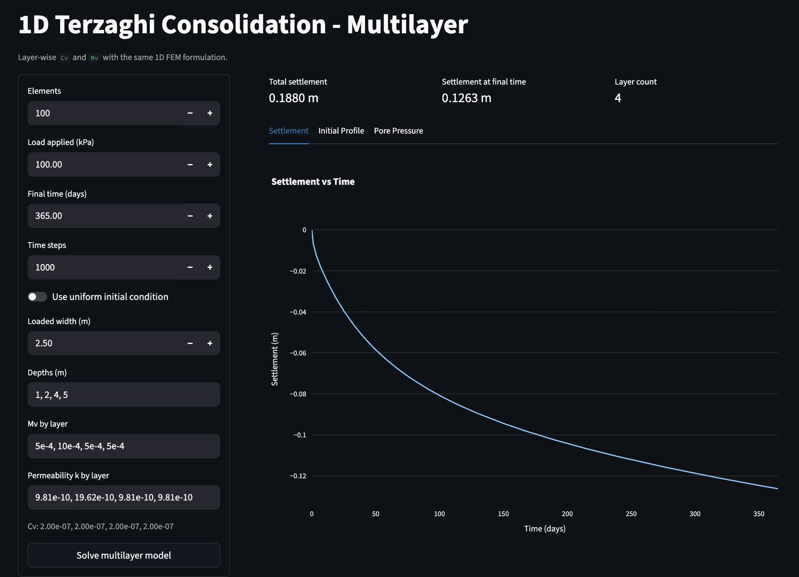
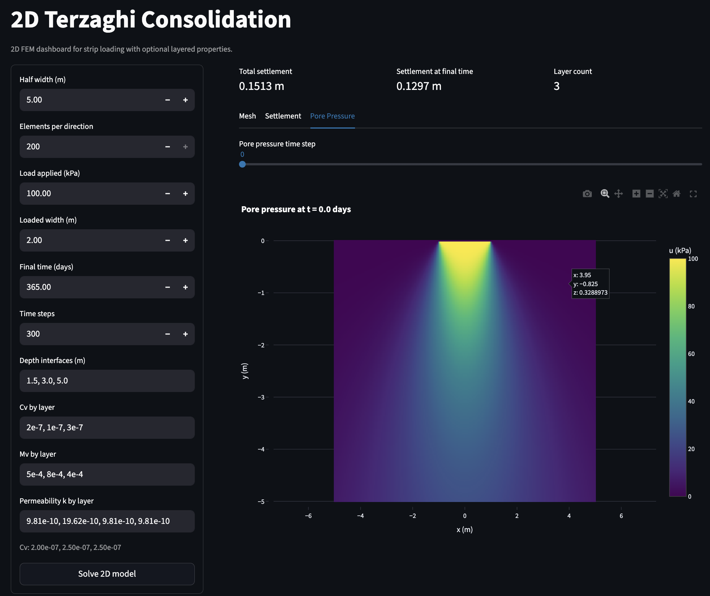
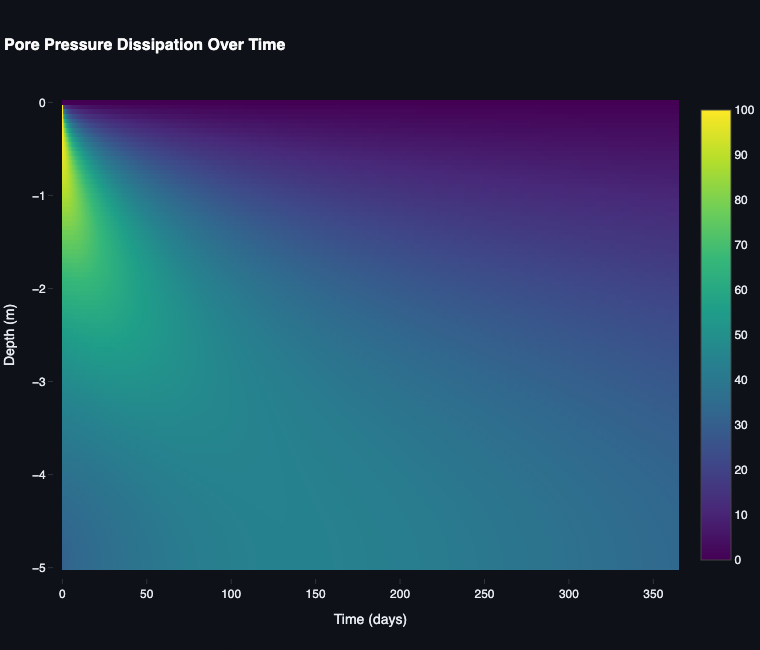
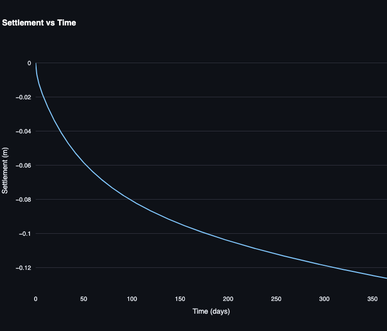
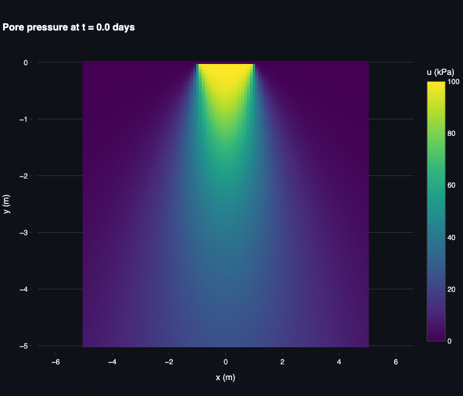
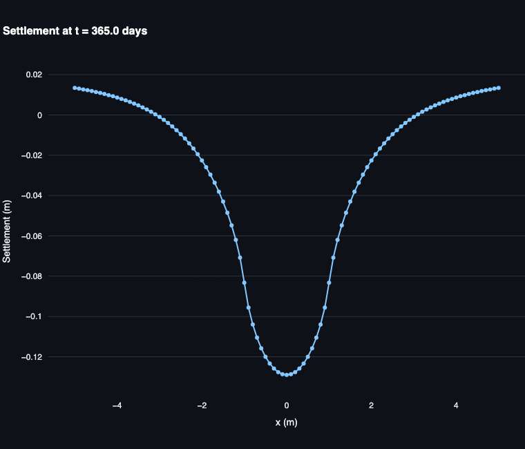

# Geotechnical Consolidation FEM (FEniCSx)

Interactive FEM dashboard for soil consolidation settlement. Enter soil, geometry, and time parameters, run a model, and inspect pore-pressure fields and settlement curves.



> This is the dissertation artifact — an interactive demo of the methods. A cleaner, library-grade reimplementation is in progress at [GeoConsolidation](https://github.com/Uthman-eng/GeoConsolidation).

## What it does

Pick a model in the sidebar, enter parameters, run. Outputs are pore-pressure fields and settlement vs time.

- **1D single-layer** — homogeneous profile, verification baseline
- **1D multilayer** — piecewise $C_v$ and $M_v$
- **2D strip load** — Boussinesq initial field, layered materials

## Interface

Each page is one model: drive it from the sidebar on the left, read the results on the right — headline settlement figures up top, tabbed plots (settlement, initial profile, pore pressure, mesh) below.

**1D multilayer** — layer depths, $M_v$ and permeability per layer; settlement vs time output:


**2D strip load** — layered properties with depth interfaces; pore-pressure field with a time-step slider:



<details>
<summary>More output plots</summary>

| 1D pore pressure | 1D settlement |
|---|---|
|  |  |

| 2D pore pressure | 2D settlement |
|---|---|
|  |  |

</details>

## Run it

```bash
git clone https://github.com/Uthman-eng/Geotechnical-Consolidation-FEM.git
cd Geotechnical-Consolidation-FEM
docker compose up --build
```

The first build takes a few minutes while Docker sets everything up. When it finishes, open **<http://localhost:8501>** in a browser — this is the interface for entering soil parameters and running the models. Stop with `Ctrl + C` in the terminal.

<details>
<summary>No coding experience? Read this.</summary>

You only need two free tools:

- **[Git](https://git-scm.com/downloads)** — downloads the project onto your computer.
- **[Docker Desktop](https://www.docker.com/products/docker-desktop)** — runs the project in a self-contained box, so you don't have to install Python or anything else yourself. After installing, **open it and leave it running**.

Open a terminal:

- **Windows:** press the Windows key, type `cmd`, press Enter.
- **Mac:** press Cmd + Space, type `Terminal`, press Enter.

Then run the three commands in the block above, one at a time, pressing Enter after each.

</details>

> The .devcontainer configuration has been removed. If you want to develop interactively in VS Code, create your own devcontainer.json pointing at the Dockerfile.

## Under the hood

- FEniCSx / DOLFINx weak-form solvers in [`src/geotech_consolidation/models/`](src/geotech_consolidation/models/); settlement via trapezoidal quadrature of pore-pressure dissipation
- Terzaghi uncoupled formulation (pore pressure and displacement not coupled), distinct from full Biot *(Biot, 1941)*
- Fourier analytical solver as reference solution

## Verification & validation

- **Convergence** — L² error against the Fourier analytical solution (Aubin–Nitsche rate check): [`notebooks/`](notebooks/)
- **Validation** — Settle3 comparison against the FEM output (kept separate from verification): [`demo/`](demo/)
- Bounds, rates, and the Nyquist aliasing argument are written up in [THEORY.md](THEORY.md)

## Theory

Terzaghi uncoupled consolidation; settlement post-processed from pore-pressure dissipation rather than solved as a coupled system. Governing equation:

$$\frac{\partial u}{\partial t} = C_v \nabla^2 u$$

with $u$ excess pore pressure, $C_v$ coefficient of consolidation, $z$ depth, and $t$ time. Settlement is computed from pore-pressure dissipation:

$$s(t) = \int_0^H m_v(z)\,[u_0(z) - u(z,t)]\, dz$$

For the 2D case, $u_0$ is taken from the Boussinesq strip-load stress field (linear elasticity for a uniform strip load), forced to zero at the drained boundary to avoid the singularity at $z = 0$.

Full derivation — weak form, discrete system, convergence bounds, settlement integral, and the Nyquist aliasing argument — is in [THEORY.md](THEORY.md).

## Project structure

```text
Geotechnical-Consolidation-FEM/
|-- app.py
|-- ui/                       # Shared Streamlit UI components
|-- pages/                    # Streamlit pages
|-- .streamlit/               # Streamlit theme and config
|-- src/geotech_consolidation/
|   |-- models/               # FEM solvers
|   `-- plotting/             # Plotting helpers
|-- notebooks/                # Verification notebooks
|-- demo/                     # Settle3 comparison
|-- assets/images/
|-- Dockerfile
|-- docker-compose.yml
|-- pyproject.toml
|-- requirements.txt
|-- THEORY.md
|-- LICENSE
`-- README.md
```

## Tech stack

Python, NumPy, FEniCSx / DOLFINx, Plotly, matplotlib, Streamlit, Jupyter, Docker.

## References

- Aziz, U. (2026). *Finite Element Modelling of Consolidation Settlement: Implementation, Verification and Open-Source Delivery* (dissertation).
- Terzaghi, K. (1943). *Theoretical Soil Mechanics*. Wiley.
- Biot, M. A. (1941). General theory of three-dimensional consolidation. *Journal of Applied Physics*, 12(2), 155–164.
- Craig, R. F. (2004). *Craig's Soil Mechanics* (7th ed.). Spon Press.
- Brenner, S. C., & Scott, L. R. (2008). *The Mathematical Theory of Finite Element Methods* (3rd ed.). Springer.
- Larsson, M. G., & Bengzon, F. (2013). *The Finite Element Method: Theory, Implementation, and Applications*. Springer.
- Rocscience. *Settle3*. [https://www.rocscience.com/software/settle3](https://www.rocscience.com/software/settle3)
- FEniCSx docs: [https://docs.fenicsproject.org/](https://docs.fenicsproject.org/)
